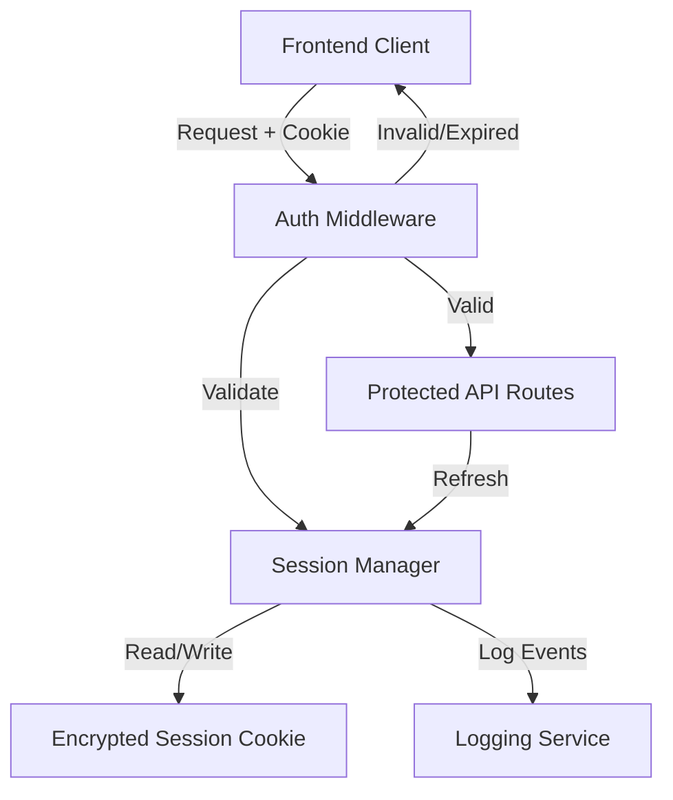
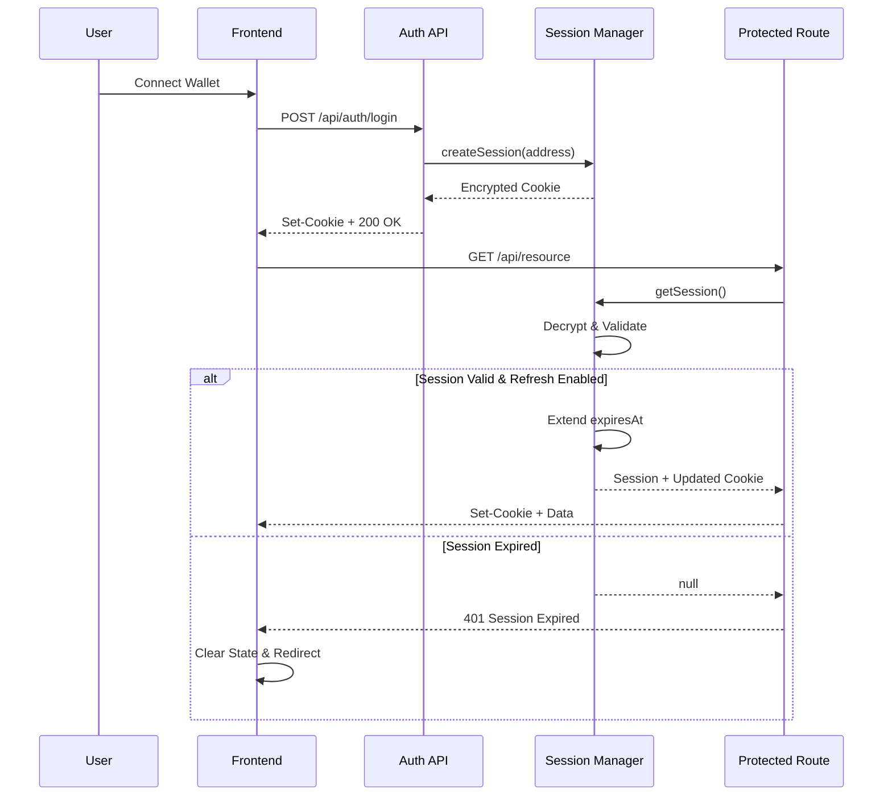

# Design Document: Session Refresh and Expiry

## Overview

This design implements session expiry and refresh mechanisms for the Remitwise application's wallet-based authentication system. The system uses iron-session for encrypted HTTP-only cookies that store user session data including Stellar wallet addresses.

The design addresses three core concerns:

1. **Security**: Sessions must expire after a configurable duration to limit the window of vulnerability if a session cookie is compromised
2. **User Experience**: Active users should maintain seamless access through optional session refresh without frequent re-authentication
3. **Observability**: Session lifecycle events must be logged for security auditing and monitoring

The implementation extends the existing session management in `lib/session.ts` and adds middleware-level enforcement across all protected API routes. The frontend will handle session expiry gracefully with user-friendly messaging and automatic redirect flows.

### Key Design Decisions

- **Sliding Window Refresh**: When enabled, each authenticated request extends the session by the full duration (7 days default), providing a smooth experience for active users
- **Configurable Behavior**: Session refresh can be toggled via environment variables to adapt to different security requirements
- **Cookie-Based State**: All session state remains in the encrypted cookie; no server-side session storage is required
- **Atomic Operations**: Session validation and refresh occur atomically within the same request cycle to prevent race conditions

## Architecture

### Component Overview



### Session Lifecycle



## Components and Interfaces

### Session Manager (`lib/session.ts`)

The Session Manager is responsible for all session operations including creation, validation, refresh, and destruction.

**Enhanced SessionData Interface:**
```typescript
interface SessionData {
  address: string;        // Stellar wallet address
  createdAt: number;      // Unix timestamp (ms) when session was created
  expiresAt: number;      // Unix timestamp (ms) when session expires
}
```

**Core Functions:**

```typescript
// Create a new session with expiry
async function createSession(address: string): Promise<string>

// Retrieve and validate current session
async function getSession(): Promise<SessionData | null>

// Validate session and refresh if enabled
async function getSessionWithRefresh(): Promise<SessionData | null>

// Require authentication or throw 401 Response
async function requireAuth(): Promise<{ address: string }>

// Clear session cookie
function clearSessionCookie(): string

// Generate Set-Cookie header with session data
function getSessionCookieHeader(sealed: string): string
```

**Configuration:**
- `SESSION_PASSWORD`: Encryption key (min 32 chars, required)
- `SESSION_MAX_AGE`: Session duration in seconds (default: 604800 = 7 days)
- `SESSION_REFRESH_ENABLED`: Enable sliding window refresh ("true"/"false", default: "false")

### Auth Middleware Pattern

Protected routes will use a consistent pattern for session validation:

```typescript
export async function GET() {
  // Validate session (with refresh if enabled)
  const session = await getSessionWithRefresh();
  
  if (!session?.address) {
    return Response.json(
      { error: 'Unauthorized', message: 'Session expired' },
      { status: 401 }
    );
  }
  
  // Process request with authenticated user
  // ...
}
```

For routes requiring authentication with automatic 401 throwing:

```typescript
export async function GET() {
  try {
    const { address } = await requireAuth();
    // Process authenticated request
  } catch (res) {
    if (res instanceof Response) return res;
    throw res;
  }
}
```

### Frontend Session Handler

A new client-side module will handle session expiry detection and user flow:

**Location:** `lib/client/sessionHandler.ts`

```typescript
interface SessionHandler {
  // Check if response indicates session expiry
  isSessionExpired(response: Response): boolean;
  
  // Handle session expiry (clear state, show message, redirect)
  handleSessionExpiry(intendedPath?: string): void;
  
  // Clear local authentication state
  clearAuthState(): void;
}
```

**Integration Points:**
- API client wrapper to intercept 401 responses
- Wallet connection state management
- Router for post-auth redirects

### Logout Endpoint

**Endpoint:** `POST /api/auth/logout`

Enhanced to use the centralized session clearing function:

```typescript
export async function POST() {
  const cookieHeader = clearSessionCookie();
  
  return Response.json(
    { ok: true, message: 'Logged out successfully' },
    {
      status: 200,
      headers: { 'Set-Cookie': cookieHeader }
    }
  );
}
```

## Data Models

### Session Cookie Structure

The session cookie is encrypted using iron-session and contains:

```typescript
{
  address: string;      // "GDEMOX...XXXX" (Stellar public key)
  createdAt: number;    // 1704067200000 (Unix timestamp in ms)
  expiresAt: number;    // 1704672000000 (Unix timestamp in ms)
}
```

**Cookie Attributes:**
- Name: `remitwise_session`
- Path: `/`
- HttpOnly: `true` (prevents JavaScript access)
- SameSite: `Lax` (allows cross-tab sharing, prevents CSRF)
- Secure: `true` (production only, requires HTTPS)
- Max-Age: Matches `SESSION_MAX_AGE` configuration

### Session Validation Logic

```typescript
function isSessionValid(session: SessionData): boolean {
  return session.expiresAt > Date.now();
}

function shouldRefreshSession(session: SessionData, refreshEnabled: boolean): boolean {
  return refreshEnabled && isSessionValid(session);
}

function calculateNewExpiry(maxAgeSeconds: number): number {
  return Date.now() + (maxAgeSeconds * 1000);
}
```

### Logging Event Schema

Session events will be logged with structured data:

```typescript
interface SessionLogEvent {
  event: 'session_created' | 'session_expired' | 'session_refreshed' | 'session_cleared';
  address: string;          // Wallet address (first 8 chars for privacy)
  timestamp: number;        // Event time
  expiresAt?: number;       // For created/refreshed events
  metadata?: {
    userAgent?: string;
    ip?: string;            // If available from headers
  };
}
```

**Security Constraints:**
- Never log the encrypted session cookie value
- Never log the SESSION_PASSWORD
- Truncate wallet addresses for privacy (e.g., "GDEMOX...XXXX")
- Use structured logging for easy querying


## Correctness Properties

*A property is a characteristic or behavior that should hold true across all valid executions of a system—essentially, a formal statement about what the system should do. Properties serve as the bridge between human-readable specifications and machine-verifiable correctness guarantees.*

### Property 1: Session Creation Completeness

*For any* Stellar wallet address, when a session is created, the resulting SessionData must contain valid `address`, `createdAt`, and `expiresAt` fields, where `expiresAt` equals `createdAt` plus the configured session duration (within a small tolerance for execution time).

**Validates: Requirements 1.1, 1.2, 1.3**

### Property 2: Session Encryption Round Trip

*For any* valid SessionData object, encrypting it with `createSession` and then decrypting it with `getSession` should produce an equivalent SessionData object with all fields preserved.

**Validates: Requirements 1.4**

### Property 3: Expired Session Rejection

*For any* session where the current time exceeds the `expiresAt` timestamp, calling `getSession` must return `null`, and any protected route using that session must return HTTP 401 with the message "Session expired".

**Validates: Requirements 2.3, 2.4**

### Property 4: Valid Session Acceptance

*For any* session where the current time is before the `expiresAt` timestamp, calling `getSession` must return the valid SessionData, and protected routes must allow the request to proceed (not return 401).

**Validates: Requirements 2.5**

### Property 5: Session Refresh Extension

*For any* valid session, when session refresh is enabled and `getSessionWithRefresh` is called, the returned session must have an `expiresAt` value equal to the current time plus the configured session duration, while the `createdAt` value remains unchanged from the original session.

**Validates: Requirements 3.1, 3.2, 3.3, 3.4**

### Property 6: Session Refresh Disabled Preservation

*For any* valid session, when session refresh is disabled and `getSession` is called multiple times, the `expiresAt` and `createdAt` values must remain constant across all calls.

**Validates: Requirements 3.5**

### Property 7: Frontend Expiry State Clearing

*For any* HTTP 401 response with message "Session expired", the frontend session handler must clear all local authentication state (stored wallet address, connection status) and the cleared state must be verifiable.

**Validates: Requirements 4.1**

### Property 8: Frontend Expiry Redirect Preservation

*For any* protected page path where session expiry occurs, the frontend must preserve that path and make it available for post-authentication redirect after the user reconnects their wallet.

**Validates: Requirements 4.4**

### Property 9: Logout Cookie Clearing

*For any* authenticated session, calling the logout endpoint must return a Set-Cookie header with `Max-Age=0` and the session cookie name, effectively clearing the session.

**Validates: Requirements 5.1, 5.2**

### Property 10: Frontend Logout Redirect

*For any* successful logout response (HTTP 200), the frontend must navigate to either the home page or login page.

**Validates: Requirements 5.4**

### Property 11: Configurable Session Duration

*For any* positive integer value set in the `SESSION_MAX_AGE` environment variable, newly created sessions must have an `expiresAt` timestamp equal to creation time plus that duration in seconds (converted to milliseconds).

**Validates: Requirements 6.4**

### Property 12: Concurrent Session Access

*For any* valid session accessed by multiple concurrent requests to protected routes, all requests must either succeed with valid session data or fail consistently, without causing race conditions or inconsistent session states.

**Validates: Requirements 8.1**

### Property 13: Session Expiry Logging

*For any* session that expires during validation, the system must log an event containing the wallet address (truncated for privacy) and the expiry timestamp, without including the encrypted session cookie or encryption keys.

**Validates: Requirements 9.1, 9.4**

### Property 14: Session Refresh Logging

*For any* session that is refreshed during validation, the system must log an event containing the wallet address (truncated for privacy) and the new expiry timestamp, without including sensitive session data.

**Validates: Requirements 9.2, 9.4**


## Error Handling

### Session Validation Errors

**Scenario: Missing Session Cookie**
- Condition: Request to protected route without session cookie
- Response: HTTP 401 with `{ error: 'Unauthorized', message: 'Not authenticated' }`
- Logging: Info level - "No session cookie present"

**Scenario: Corrupted Session Cookie**
- Condition: Session cookie exists but cannot be decrypted
- Response: HTTP 401 with `{ error: 'Unauthorized', message: 'Invalid session' }`
- Action: Clear the corrupted cookie via Set-Cookie with Max-Age=0
- Logging: Warning level - "Failed to decrypt session cookie"

**Scenario: Expired Session**
- Condition: Session cookie decrypts successfully but `expiresAt < Date.now()`
- Response: HTTP 401 with `{ error: 'Unauthorized', message: 'Session expired' }`
- Action: Clear the expired cookie via Set-Cookie with Max-Age=0
- Logging: Info level - "Session expired for address GDEMOX...XXXX at timestamp"

**Scenario: Missing Required Fields**
- Condition: Decrypted session lacks `address` or `expiresAt`
- Response: HTTP 401 with `{ error: 'Unauthorized', message: 'Invalid session data' }`
- Action: Clear the invalid cookie
- Logging: Warning level - "Session missing required fields"

### Configuration Errors

**Scenario: Missing SESSION_PASSWORD**
- Condition: Environment variable not set or less than 32 characters
- Response: Server fails to start with clear error message
- Error: `Error: SESSION_PASSWORD must be set and at least 32 characters`
- Logging: Error level - "Invalid SESSION_PASSWORD configuration"

**Scenario: Invalid SESSION_MAX_AGE**
- Condition: Environment variable is not a valid positive integer
- Response: Fall back to default value (604800 seconds)
- Logging: Warning level - "Invalid SESSION_MAX_AGE, using default 7 days"

**Scenario: Invalid SESSION_REFRESH_ENABLED**
- Condition: Environment variable is not "true" or "false"
- Response: Treat as disabled (default behavior)
- Logging: Info level - "SESSION_REFRESH_ENABLED not set, refresh disabled"

### Frontend Error Handling

**Scenario: Network Error During Session Check**
- Condition: Request to protected route fails due to network issues
- Action: Display generic error message, do not clear session state
- User Message: "Unable to connect. Please check your internet connection."

**Scenario: Session Expired During Multi-Step Flow**
- Condition: User is in the middle of a transaction when session expires
- Action: Save form state to localStorage, redirect to wallet connection
- User Message: "Your session has expired. Please reconnect your wallet to continue."
- Post-Auth: Restore form state and return to the flow

**Scenario: Concurrent Tab Session Expiry**
- Condition: Session expires in one tab while user is active in another
- Action: Next request in any tab will receive 401 and trigger expiry flow
- User Message: "Your session has expired. Please reconnect your wallet."
- Note: All tabs will eventually sync to the expired state

### Graceful Degradation

**Scenario: Logging Service Unavailable**
- Condition: Logger fails to write session events
- Action: Continue processing the request, do not fail authentication
- Fallback: Log to console.error as backup
- Monitoring: Track logging failures separately

**Scenario: Cookie Size Limits**
- Condition: Session data exceeds browser cookie size limits (4KB)
- Prevention: SessionData structure is minimal (~200 bytes encrypted)
- Mitigation: If expansion is needed, consider server-side session storage

## Testing Strategy

### Dual Testing Approach

This feature requires both unit tests and property-based tests to ensure comprehensive coverage:

- **Unit Tests**: Verify specific examples, edge cases, and integration points
- **Property-Based Tests**: Verify universal properties across randomized inputs

Unit tests should focus on concrete scenarios and error conditions, while property tests validate that correctness properties hold across all possible inputs. Together, they provide confidence in both specific behaviors and general correctness.

### Property-Based Testing

**Framework**: Use `fast-check` for TypeScript property-based testing

**Configuration**:
- Minimum 100 iterations per property test (due to randomization)
- Each test must reference its design document property via comment tag
- Tag format: `// Feature: session-refresh-and-expiry, Property {number}: {property_text}`

**Test Organization**:
```
tests/
  session/
    session.property.test.ts    # Properties 1-6, 9, 11-14
    frontend.property.test.ts   # Properties 7-8, 10
```

**Example Property Test Structure**:
```typescript
import fc from 'fast-check';

describe('Session Refresh and Expiry - Property Tests', () => {
  // Feature: session-refresh-and-expiry, Property 1: Session Creation Completeness
  it('creates sessions with complete data structure', () => {
    fc.assert(
      fc.asyncProperty(
        fc.string({ minLength: 56, maxLength: 56 }), // Stellar address
        async (address) => {
          const before = Date.now();
          const sealed = await createSession(address);
          const session = await unsealData(sealed, { password: getPassword() });
          const after = Date.now();
          
          expect(session.address).toBe(address);
          expect(session.createdAt).toBeGreaterThanOrEqual(before);
          expect(session.createdAt).toBeLessThanOrEqual(after);
          expect(session.expiresAt).toBeGreaterThanOrEqual(
            session.createdAt + SESSION_MAX_AGE * 1000 - 100
          );
          expect(session.expiresAt).toBeLessThanOrEqual(
            session.createdAt + SESSION_MAX_AGE * 1000 + 100
          );
        }
      ),
      { numRuns: 100 }
    );
  });
});
```

**Property Test Coverage**:
- Property 1: Generate random Stellar addresses, verify session structure
- Property 2: Generate random SessionData, test encryption round trip
- Property 3: Generate sessions with past expiresAt, verify rejection
- Property 4: Generate sessions with future expiresAt, verify acceptance
- Property 5: Generate valid sessions, verify refresh extends expiry
- Property 6: Generate valid sessions with refresh disabled, verify no change
- Property 7: Generate 401 responses, verify state clearing
- Property 8: Generate random paths, verify redirect preservation
- Property 9: Generate authenticated sessions, verify logout clears cookie
- Property 10: Generate logout responses, verify navigation
- Property 11: Generate random positive integers, verify session duration
- Property 12: Generate concurrent requests, verify consistency
- Property 13: Generate expired sessions, verify logging without sensitive data
- Property 14: Generate refresh events, verify logging without sensitive data

### Unit Testing

**Framework**: Jest with Next.js testing utilities

**Test Organization**:
```
tests/
  session/
    session.test.ts           # Session manager functions
    middleware.test.ts        # Auth middleware patterns
    logout.test.ts            # Logout endpoint
    config.test.ts            # Configuration handling
  frontend/
    sessionHandler.test.ts    # Frontend session handling
```

**Unit Test Focus Areas**:

1. **Session Creation**
   - Default 7-day expiry when SESSION_MAX_AGE not set
   - Custom expiry when SESSION_MAX_AGE is configured
   - Encryption with iron-session

2. **Session Validation**
   - Valid session returns correct data
   - Expired session returns null
   - Corrupted cookie returns null
   - Missing cookie returns null

3. **Session Refresh**
   - Refresh enabled: expiresAt updated, createdAt preserved
   - Refresh disabled: no changes to session
   - Configuration toggle via SESSION_REFRESH_ENABLED

4. **Protected Routes**
   - Valid session allows access
   - Expired session returns 401
   - Missing session returns 401
   - Correct error messages in responses

5. **Logout**
   - Cookie cleared with Max-Age=0
   - Returns 200 with success message
   - Works with and without existing session

6. **Frontend Handling**
   - 401 detection triggers expiry flow
   - Local state cleared on expiry
   - Redirect to wallet connection
   - Intended destination preserved
   - Logout triggers navigation

7. **Configuration**
   - SESSION_REFRESH_ENABLED="true" enables refresh
   - SESSION_REFRESH_ENABLED="false" disables refresh
   - SESSION_REFRESH_ENABLED unset defaults to disabled
   - SESSION_MAX_AGE defaults to 604800
   - Invalid SESSION_MAX_AGE falls back to default

8. **Logging**
   - Session expiry logged with address and timestamp
   - Session refresh logged with address
   - No sensitive data in logs (no cookies, no passwords)
   - Wallet addresses truncated for privacy

9. **Edge Cases**
   - Session expires during request processing
   - Multiple tabs with same session
   - Cookie size within browser limits
   - SameSite=Lax attribute present
   - Secure flag in production

10. **Error Conditions**
    - Missing SESSION_PASSWORD throws on startup
    - SESSION_PASSWORD too short throws on startup
    - Corrupted session data handled gracefully
    - Network errors don't clear valid sessions

### Integration Testing

**Scenarios to Test**:

1. **End-to-End Session Lifecycle**
   - Login → Access protected route → Session expires → 401 → Reconnect wallet
   - Login → Access protected route → Logout → 401 on next request

2. **Session Refresh Flow**
   - Enable refresh → Login → Wait 1 day → Access route → Session extended
   - Disable refresh → Login → Wait 1 day → Access route → Session unchanged

3. **Multi-Tab Behavior**
   - Open two tabs → Login in tab 1 → Access protected route in tab 2 → Both work
   - Open two tabs → Session expires → Both tabs receive 401 on next request

4. **Configuration Changes**
   - Change SESSION_MAX_AGE → Restart → New sessions use new duration
   - Toggle SESSION_REFRESH_ENABLED → Restart → Refresh behavior changes

### Manual Testing Checklist

- [ ] Login with wallet and verify session cookie is set
- [ ] Access protected route and verify success
- [ ] Wait for session to expire and verify 401 response
- [ ] Verify expiry message displays correctly in UI
- [ ] Verify redirect to wallet connection page
- [ ] Reconnect wallet and verify redirect to intended page
- [ ] Logout and verify session cleared
- [ ] Verify logout redirects to home page
- [ ] Open multiple tabs and verify session works in all
- [ ] Expire session and verify all tabs receive 401
- [ ] Enable refresh and verify session extends on activity
- [ ] Disable refresh and verify session doesn't extend
- [ ] Check browser DevTools for correct cookie attributes
- [ ] Verify logs contain session events without sensitive data

### Performance Considerations

**Session Validation Performance**:
- Target: < 10ms for session decryption and validation
- Monitoring: Track p95 latency for `getSession` calls
- Optimization: iron-session is already optimized for performance

**Cookie Size**:
- Current: ~200 bytes encrypted (well under 4KB limit)
- Monitoring: Track cookie size if SessionData expands

**Logging Performance**:
- Async logging to avoid blocking request processing
- Batch logs if volume is high
- Monitor logging service health separately

